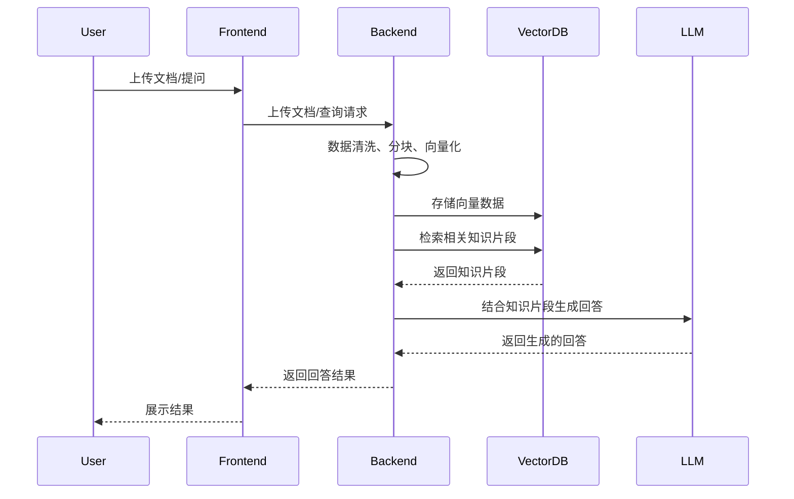

# 家具维修 RAG 系统架构设计

## 整体架构
本系统采用前后端分离模式，后端负责数据处理和模型调用，前端提供用户交互界面。结合提供的技术栈（Vite+Vue 前端、LangChain+ChromaDB 后端），各模块协同工作以实现家具维修领域的检索增强生成功能。

### 核心模块
1. **数据爬取模块**：实现家具维修相关网站的定向爬取，支持 URL 输入和自动发现相关内容，包含 HTML 解析、文本提取和基本清洗功能。
2. **数据处理模块**：支持 PDF、MD、TXT 等常见文档格式的加载，实现文本分块（基于 RecursiveCharacterTextSplitter），使用 BGE 等模型进行文本向量化，并将向量数据存入 ChromaDB 并建立索引。
3. **RAG 核心引擎**：封装 LangChain 的 RetrievalQA 链，实现查询向量化和相似性检索，设计家具维修领域专用的 Prompt 模板，支持主流 LLM 的调用（如通义千问、ChatGLM 等）。
4. **前端界面**：包含知识库管理界面（上传、查看、删除文档）、问答交互界面（提问、查看结果）和历史记录管理，采用响应式设计，适配不同设备。

## 系统流程图

## 技术选型
### 后端
- **Python + FastAPI**：作为 API 服务，提供高效、简洁的接口开发体验。
- **LangChain**：处理 RAG 逻辑，简化大模型集成和检索流程。
- **ChromaDB**：作为向量数据库，支持高效的向量存储和检索。
- **Hugging Face 模型**：进行向量化，提供高质量的文本嵌入。

### 前端
- **Vue 3 + Vite**：构建用户界面，实现快速开发和热更新。
- **Element Plus 或自定义 UI 组件**：提供美观、易用的界面元素。
- **Axios**：进行 API 请求，处理前后端数据交互。
- **Pinia**：管理应用状态，方便状态的共享和更新。